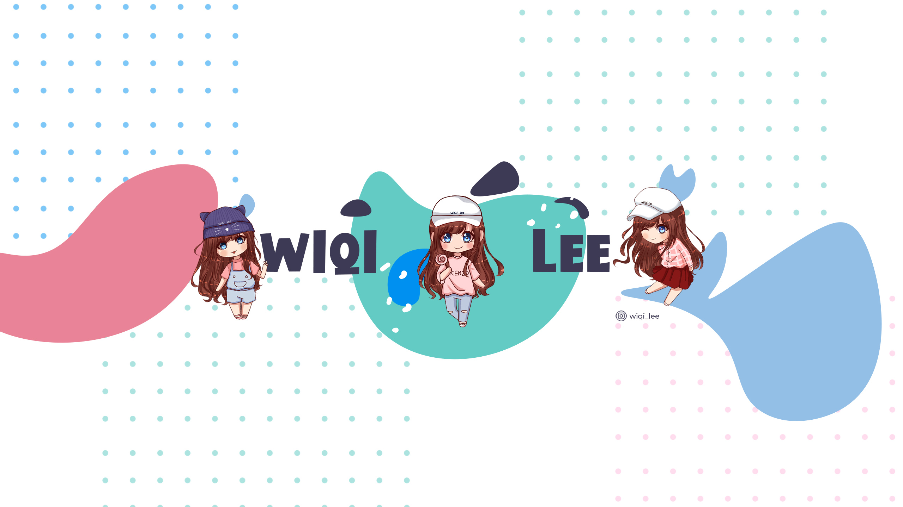

<!-- Banner -->

  

<!-- Typing effect -->

  

<!-- Glitter Text -->
## 🚀 About Me
I’m **Wiqi Lee**, a passionate developer and researcher dedicated to creating impactful, real-world solutions and contributing to the open-source ecosystem.  
🌱 Currently exploring **Next.js**, **AI-driven workflows**, and **cloud-native ecosystems**.  
🧠 Deeply interested in **Large Language Models (LLMs)**, **agentic AI**, and emerging frameworks such as **LangChain**, **Ollama**, and **LangGraph**.  
📚 Beyond code, I enjoy reading **scientific journals** and collaborating on **academic research, publishing, and paraphrasing projects**.

  

---

## 🛠️ Technical Skills

### Languages

### Front-End Development

### Back-End Development

### Mobile App Development

### DevOps & Cloud Technologies

### AI & Data Science

### MLOps & Vector Databases

### Modern Data Stack

### Data Engineering & Big Data

---

## 📖 Research & Writing
- Passionate about **scientific research**, **academic writing**, and **journal publication workflows**.  
- Experienced with **Scopus-indexed journals (Q1–Q3)** and open to collaboration on **writing, paraphrasing, data analysis, and submission support**.  
- Skilled in **SPSS**, **quantitative & qualitative research methods**, and well-versed in **AI-assisted research workflows** using **Hugging Face**, **LangChain**, and **LLMs**.

### Journal Indexing & Impact

### Research Tools
  
  
  
  

---

## ☕ Support

  
  &nbsp;&nbsp;&nbsp;
  

---

## 🔗 Connect with Me

  
  &nbsp;
  
  &nbsp;
  
  &nbsp;
  
  &nbsp;
  

  
  &nbsp;
  

---

## 📊 GitHub Stats
<table>
  <tr>
    <td>
      
    </td>
    <td>
      
    </td>
  </tr>
</table>

  

  

---

## 🏆 Trophies & Activity

  

  

